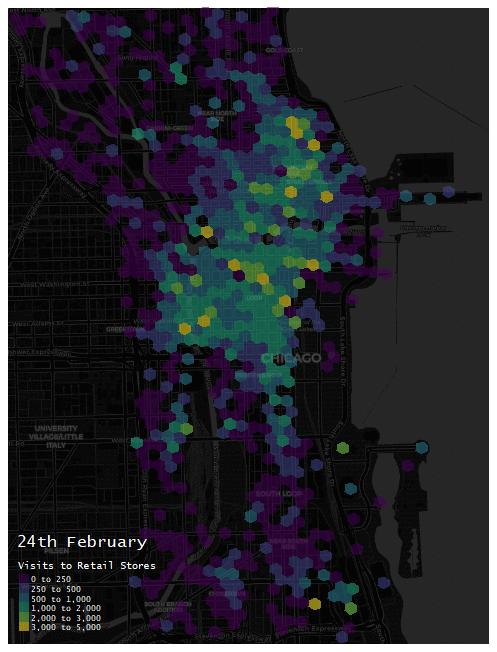

# 30DayMapChallenge

This repo contains my efforts at the annual #30DayMapChallenge:
- **2021**: 3D visualisation of Starbucks locations (Theme: 3D)
- **2020**: COVID-19 retail patterns (Theme: Hexagons)

## 2021

## 2020

I made this quick gif here to illustrate changes in mobility around retail stores prior to and during the first peak of the COVID-19 pandemic. Using the 'core places' and 'weekly patterns' datasets from SafeGraph, which can be accessed [here](https://www.safegraph.com/covid-19-data-consortium), i aggregated individual store patterns to H3 geometries (hexagons) using the ['h3jsr'](https://github.com/obrl-soil/h3jsr) R package and have animated a subset of these from the last week of February, to early April.

Code for the map can be found [here](Patterns_Hexmap.R) - built mostly with tmap & sf, with additional functions provided by h3jsr (for H3 geometries), ceramic (static carto basemap) and magick (assemblage of GIF).

   

  

Acknowledgements
* Thanks to SafeGraph for provision of their data through their COVID-19 Data Consortium. 
* Thanks also to Robin Lovelace/Jakub Nowosad and Lex Comber/Chris Brunsdon, their respective books ["Geocomputation in R"](https://geocompr.robinlovelace.net/index.html) and ["An introduction to R for Spatial Analysis and Mapping"](https://bookdown.org/lexcomber/brunsdoncomber2e) have proven invaluable for my 'spatial' workflow.
